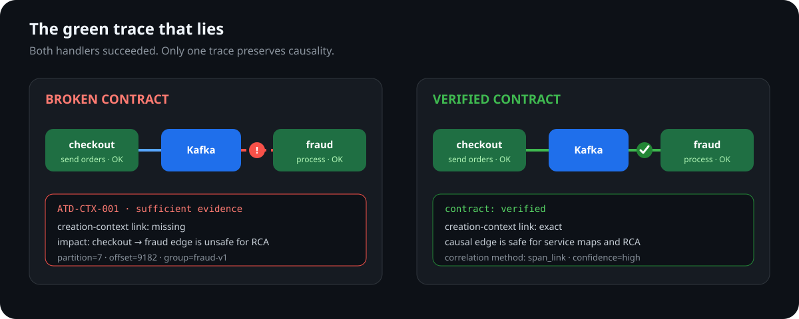

<p align="center">
  
</p>

<h1 align="center">AsyncTraceDoctor</h1>

<p align="center">
  <strong>Catch broken OpenTelemetry messaging links before they corrupt service maps and RCA.</strong>
  <br>
  A coverage-aware trace-contract gate for asynchronous systems.
</p>

<p align="center">
  
  
  <a href="LICENSE"></a>
  
</p>

<p align="center">
  
</p>

AsyncTraceDoctor verifies the telemetry contract between messaging producers and consumers. It checks whether message-creation context, batching links, broker identity, retries, and expected fan-out are represented well enough for downstream service maps and root-cause analysis to be causally trustworthy.

It is **not** an APM backend and it does **not** infer business message loss from missing spans. When sampling, export loss, state eviction, or late telemetry makes an absence unsafe to interpret, the report says `insufficient` instead of manufacturing certainty.

## The failure it catches

A consumer can finish successfully while its OpenTelemetry `process` span is detached from the producer. APM screens remain green, but the service-map edge disappears and RCA attributes the work to the wrong root.

```text
AsyncTraceDoctor: 2 spans, 2 messaging spans, 1 findings,
context completeness 0.0%, coverage complete

ERROR  ATD-CTX-001  checkout -> fraud  kafka/orders
       identity_candidate  high  sufficient
       Consumer process span has no message-creation context reference.
```

If the consumer has a valid link whose target span is absent, the result is deliberately different:

```text
WARNING  ATD-COV-001  -> fraud  kafka/orders
         unresolved_context_reference  low  insufficient
         Check sampling, export loss, eviction, and Collector routing first.
```

## Why this is not another APM

| Existing layer | What it does | What AsyncTraceDoctor checks |
|---|---|---|
| Jaeger, Tempo, Elastic, Honeycomb, Datadog APM | Stores, queries, and visualizes the telemetry it receives | Whether async causal relationships in that telemetry satisfy a declared contract |
| Prometheus/span metrics | Aggregates rates, errors, and latency | Whether those aggregates are based on structurally trustworthy messaging spans |
| Kafka/RabbitMQ monitoring | Reports broker health, lag, queue depth, or redelivery | Whether application spans preserve creation context across producer/consumer boundaries |
| OpenTelemetry Collector | Routes and processes telemetry | AsyncTraceDoctor currently receives OTLP beside a Collector; a native connector is the target deployment shape |

## Quick start

Requirements: Go 1.25+.

```bash
go build -o bin/async-trace-doctor ./cmd/async-trace-doctor
./bin/async-trace-doctor audit \
  --input testdata/core/broken-context.json \
  --rules config/rules.yaml \
  --json report.json
```

Exit codes are stable: `0` pass, `1` input/runtime error, and `2` sufficient-evidence finding at or above `failOnSeverity`. Findings marked `insufficient` do not fail policy unless `failOnInsufficientEvidence: true` is explicitly configured.

Receive live OTLP:

```bash
./bin/async-trace-doctor serve --rules config/rules.yaml
curl http://localhost:8080/ready
curl http://localhost:8080/report
curl http://localhost:8080/metrics
```

Run the broker-backed Kafka demo:

```bash
docker compose up --build
# report:     http://localhost:18080/report
# metrics:    http://localhost:18080/metrics
# Prometheus: http://localhost:19090
```

Use `ATD_FAULT_MODE=no_inject`, `no_extract`, `no_link`, `batch_incomplete`, or `duplicate` to alter telemetry behavior. Ground-truth answers are never sent to the auditor.

## What it checks

| Contract risk | Evidence and behavior |
|---|---|
| Missing creation context | Span links or direct single-message parent context |
| Unresolved context | Valid context exists but its target is unavailable; reported as insufficient evidence |
| Kafka correlation | Message ID, or partition+offset when both sides provide them |
| RabbitMQ destination shape | Strong links remain valid when consumer destinations add a queue suffix |
| Batch coverage | Declared count, link contexts, and per-message link attributes |
| Retry vs duplicate processing | Identity, consumer group/subscription, status/error evidence, and bounded attempt windows |
| Queue latency and clock skew | Signed producer-end to consumer-start latency |
| Topology contracts | Expected, denied, ignored, and opt-in per-message fan-out edges |
| Semantic validity | Service, messaging system, destination, operation type, SpanKind, OTLP identities, and timestamps |

Rules are versioned policy, not a no-code plugin system. Checks are implemented in Go; YAML controls enablement, severity, messages, thresholds, and scopes by operation, system, service, destination, and environment.

## Coverage-aware conclusions

Every finding contains an `evidence_state`:

- `sufficient`: the observed span itself proves the contract violation, or a finalized input was explicitly declared complete.
- `insufficient`: the conclusion depends on missing telemetry whose completeness is unknown.
- `degraded`: receiver rejection, TTL eviction, or OTLP dropped fields affected the evidence window.

Live windows are always coverage-unknown unless an external mechanism can prove completeness. OTLP partial-success responses expose capacity or conflicting-identity rejection instead of silently acknowledging dropped evidence. Reports include cumulative rejection, duplicate-export, conflict, eviction, and dropped-field counts.

## Correlation order

1. exact span link;
2. direct producer parent context for a single-message consumer;
3. message identity (`messaging.message.id`, or Kafka partition+offset);
4. nearest producer inside an indexed broker route and bounded time window.

Links are causal evidence and are not rejected merely because producer/consumer display destinations differ. Attribute and time fallbacks remain isolated by environment, service namespace, destination namespace, and broker address when both sides provide those fields.

## Support matrix

| Area | Evidence level |
|---|---|
| OTLP/HTTP and OTLP/gRPC | Unit-tested receiver and parsing |
| Kafka | Live Redpanda E2E for propagation, batching, and duplicates; broker identity normalization is partial |
| RabbitMQ | Semantic fixture coverage for destination shape; **no live RabbitMQ E2E yet** |
| Other messaging systems | Generic semantic validation only; no production-support claim |
| Scale | Indexed correlation microbenchmarks; no sustained receiver/RSS/load claim |

## Measured microbenchmarks

On a Ryzen 5 5625U, Windows/amd64, Go 1.26.3:

| Scenario | Input | Observed time | Allocated/op |
|---|---:|---:|---:|
| Indexed message identity, 100 routes | 10,000 spans | 28.1–35.7 ms | ~8.1 MiB |
| One hot route without identity | 1,000 spans | 2.4–2.7 ms | ~0.52 MiB |

These are correlation microbenchmarks, not server throughput or production capacity claims. Reproduce with:

```bash
go test -run '^$' -bench BenchmarkCorrelate -benchmem -count 3 ./internal/correlation
```

## Evaluation

The evaluator currently separates four core cases, two holdout cases, three adversarial cases, and five live Kafka scenarios. Adversarial coverage includes an unresolved valid link, cross-environment message-ID collision, and RabbitMQ producer/consumer destination-shape differences.

It reports exact finding-set accuracy (rule IDs and expected counts), per-rule precision and recall, topology accuracy, normal false-positive rate, and SHA-256 provenance for rules and datasets. These remain small synthetic datasets and are not production-accuracy claims.

```bash
go run ./evaluation/cmd/evaluate
pwsh ./scripts/live-e2e.ps1
```

See [evaluation methodology](docs/EVALUATION.md), [architecture](docs/ARCHITECTURE.md), and the [release-risk register](docs/QA-GAP-ANALYSIS.md).

## Current limits

- State is single-process and in-memory; replicas do not share correlation state.
- Idle streams do not advance the live event-time watermark.
- Kafka identity support does not yet model cluster metadata, commits, rebalances, or delivery attempts.
- RabbitMQ redelivery, ack/nack, delivery tag, vhost, and DLQ lifecycle are not normalized.
- Time fallback is low confidence and remains ambiguous on a dense same-route window.
- No built-in TLS, authentication, or tenant authorization; deploy behind a trusted Collector/proxy.
- No sustained load, container RSS, recovery, or multi-replica correctness evidence yet.

## Roadmap to production credibility

1. OpenTelemetry Collector connector with explicit metric/log temporality.
2. Kafka and RabbitMQ delivery-lifecycle adapters.
3. Allowed lateness, stable finding fingerprints, retractions, and shard-safe state.
4. External compatibility corpus across SDK/instrumentation versions.
5. Sustained throughput, RSS, recovery, and false-positive benchmarks.

Contributions should add a negative test, evidence semantics, and provenance alongside implementation. See [CONTRIBUTING.md](CONTRIBUTING.md).
